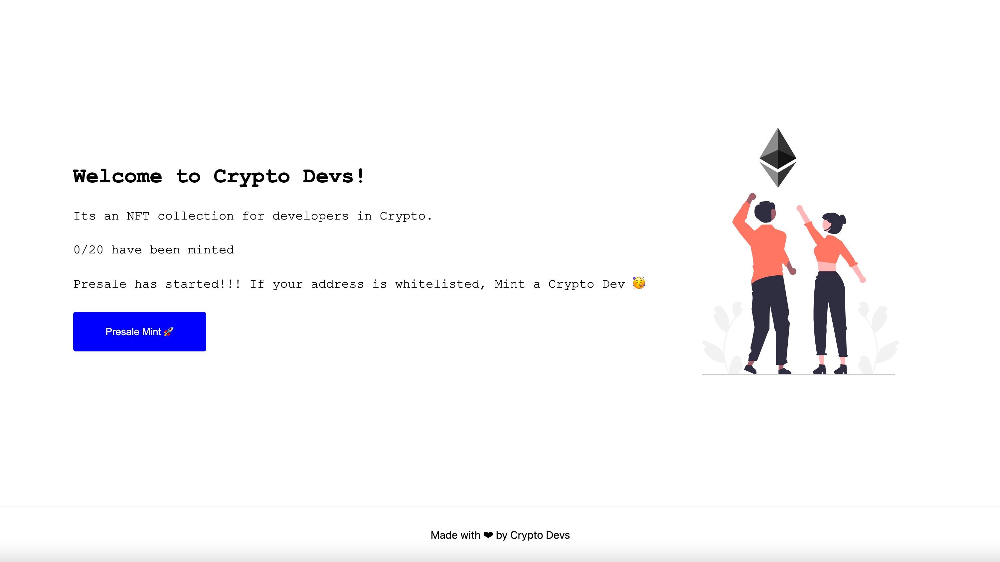
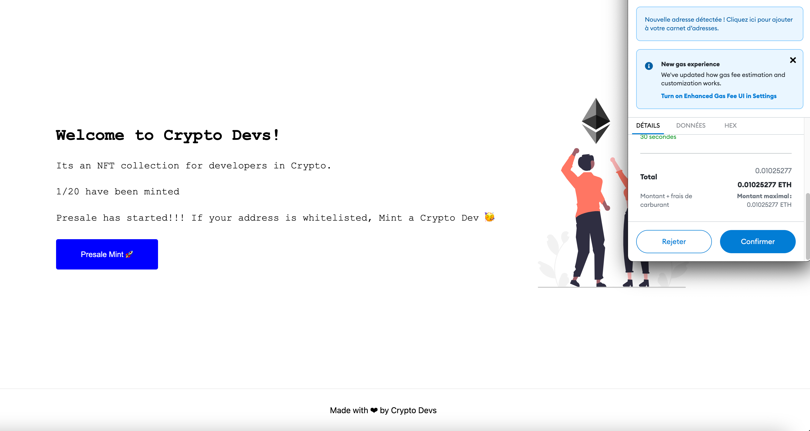

# Crypto Devs NFT Collection

Front end of the Dapp that allows you to mint NFT with your Metamask wallet. The smart contract of this Dapp is built on the Ethereum blockchain (in Solidity) and is accessible at this address `0x99220f68bC0FFFC30256EbA87910C9ac6837A76B`

👀 watch it live : [https://nft-collection-front-seven.vercel.app/](https://nft-collection-front-seven.vercel.app/)

### Stack

- Nextjs
- Hosted on Vercel
- Web3Modal
- ethers.js

### Smart contract code

[https://github.com/DumasOlivier/nft-collection](https://github.com/DumasOlivier/nft-collection)

### Requirements

- There should only exist 20 Crypto Dev NFT's and each one of them should be unique.
- User's should be able to mint only 1 NFT with one transaction.
- Whitelisted users, should have a 5 min presale period before the actual sale where they are guaranteed 1 NFT per transaction.
- There should be a website for your NFT Collection.

### Screenshots

